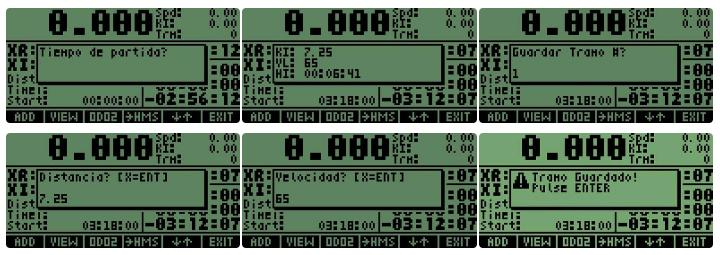
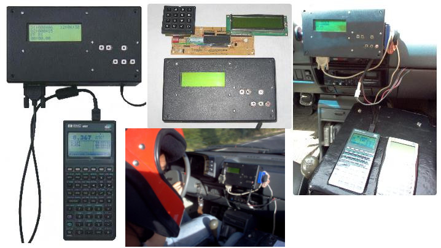

# Nav48

Rally computer for amateur and professional rally teams. Using a Hp48 calculator, the rally team enter the race variables (navegation route challange) and the software give the next information:

 - `Current position`, from odometer interfaced from car to hardware device with a switch sensor or hall effect sensor.
 - `Target position`, calculated for keep car synced.
 - `Distance offset`, calculated from current position and race data.
 - `Current track`, from race information.
 - `Multiple time mode`, track time, race time, start and end time, etc.

This README was imported from: https://hpsaturn.com/terratrip/

## TODO

- [x] Restore lost Hp48 source from old backup (RPLSysPC untested project)
- [ ] Restore Hp48 source from Emu48 file project backup
- [ ] Search HC908 microcontroller lost source (missing for now)
- [ ] Build a fuctional Nav48 version for 2026 (Hp48gx, Hp49g, Hp49g+)
- [ ] ESP32 migration or recreation of Nav48 hardware on it

## Technologies

The original version from 2005 has the next technologies:

* `Motorola 68HC908`: Firmware developed in assembler on a Motorola `MC68HC908GP32` with a few code on `C`. 
* `CodeWarrior`: IDE, compiler, debugger and in-circuit programming.
* `Hp48`: Navigation software using a `Hewlett Packard Hp48` interfaced via Serial connection. 
* `Jazz library`: Low level IDE, compiler and debugger for `SysRPL` and `Hp48 Saturn CPU assembler`.

## Nav48 Source Code

The original source code was lost but I found and old backup (20050830) of a RplSysPC (Saturn and RPL compiler) project for Windows that I tried to migrate to PC in these years. The idea is try to restore the original source from some emulator files. For now this repo is the working progress code that I have. 

If you want try to compile this code, you need this tool:

[HP 48 Software Development Tools](https://www.hpcalc.org/details/3819?6duPAbJ=PIUIvhc)

## Nav48 Hardware

## Awards

With this hardware and software, my team won around 8 trophies and two championship on Bogotá on three years in two modalities, 4x4 and regularity.

## Credits

- Alberto Solano: First pilot and sponsor to make the original idea of try to implement this software and hardare
- Alejandro Pilioneta: Pilot and sponsor of this project